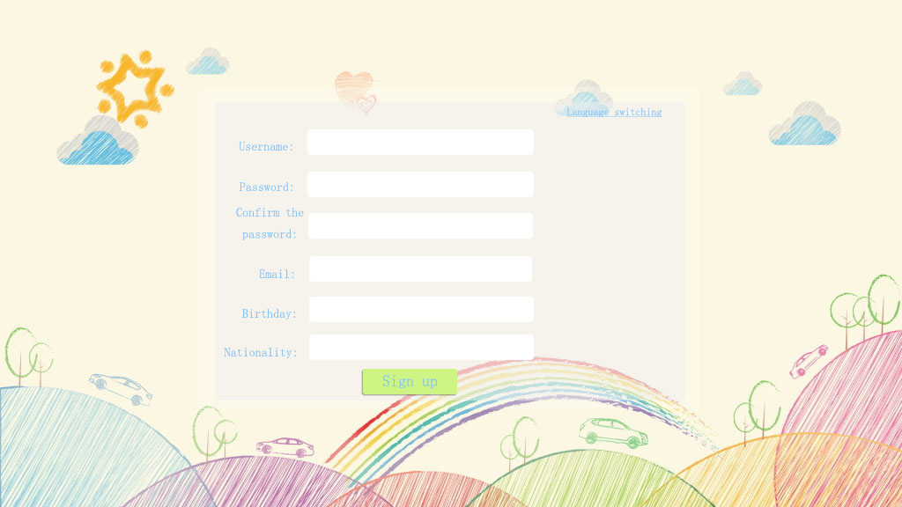
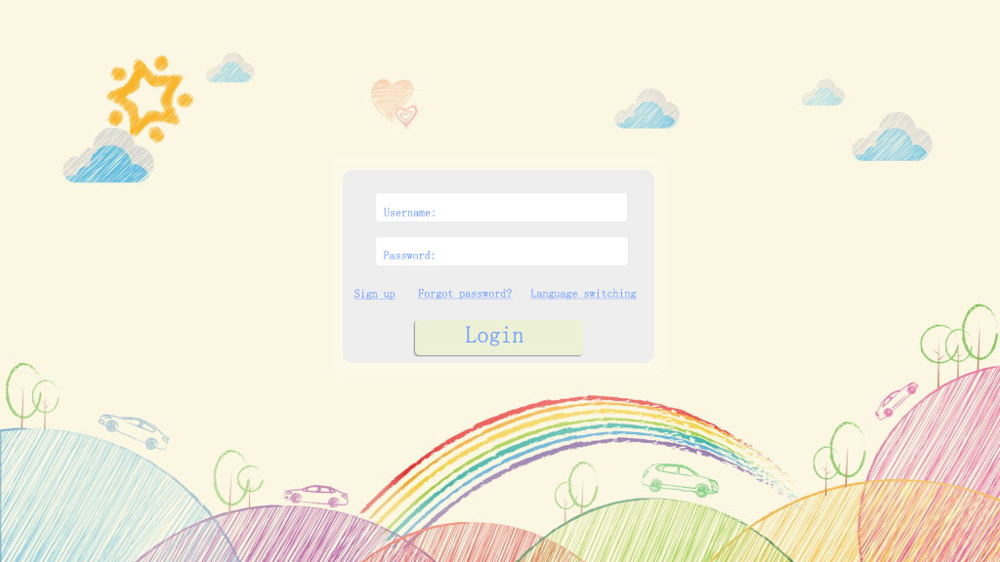
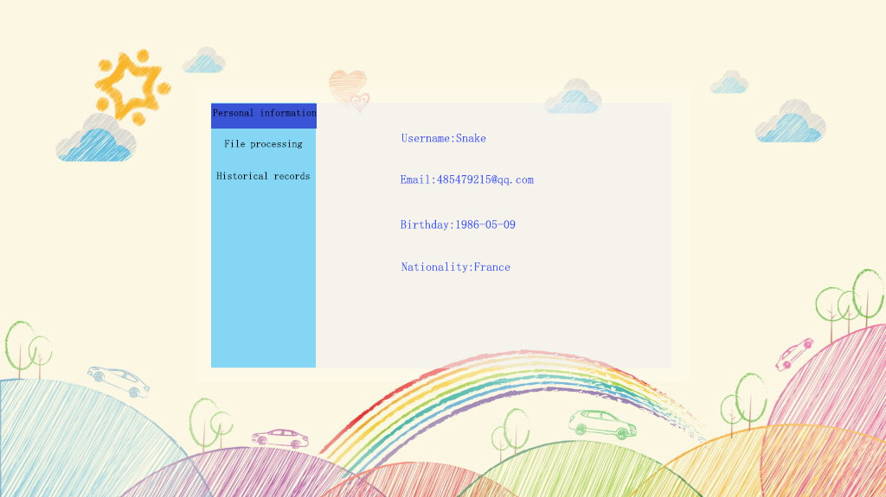
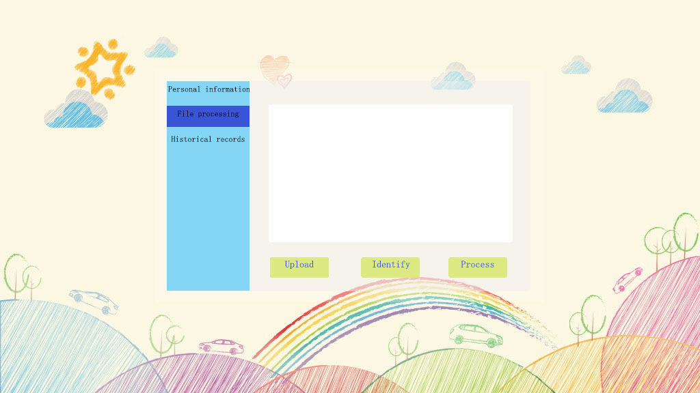
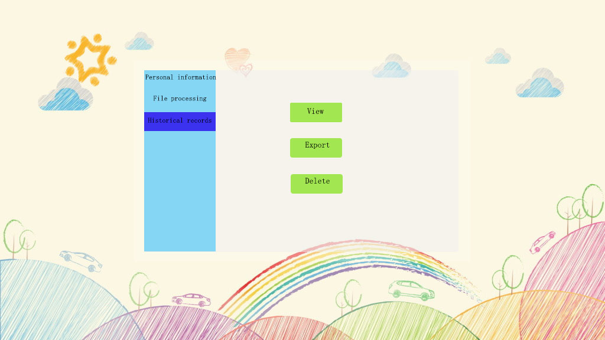

Functional Requirements
=======================

Functions
---------

===================================	=============================================================================================================================================================================================================================================================	=========
Function								Description																																																													User
===================================	=============================================================================================================================================================================================================================================================	=========
User register						Users need to register an account for the first time to use OMGAPP，which support the use of other functions.																																					All users
User login							After the user registers the account, you need to log in to use other functions.																																												All users
User information management			For modifying the nickname/password/signatures other modifiable information.																																													All users
gene expression file upload			Users can upload gene expression files																																																							All users
Gene expression file identification	The software needs to support automatically identifying whether the file format is a valid gene expression file. If it is, it can be processed in the next step. Otherwise, the file is not a valid gene expression file, and user need to upload other file.	All users
Gene expression file processing		After determining that the gene expression file uploaded by the user is a valid file, the product need to feedback a table and scatter chart.																													All users
History View						Users can view past operation records and results, such as viewing gene expression files uploaded from history, analyzing tables and hash diagrams obtained from the files, etc.																				All users
Historical derivation				Users can export some historical genetic files, analysis tables and scatter charts.	All users
History record deleting				Users can delete history information that they do not want to keep.	All users
===================================	=============================================================================================================================================================================================================================================================	=========

register
--------

Login
-----

Other Page
----------

